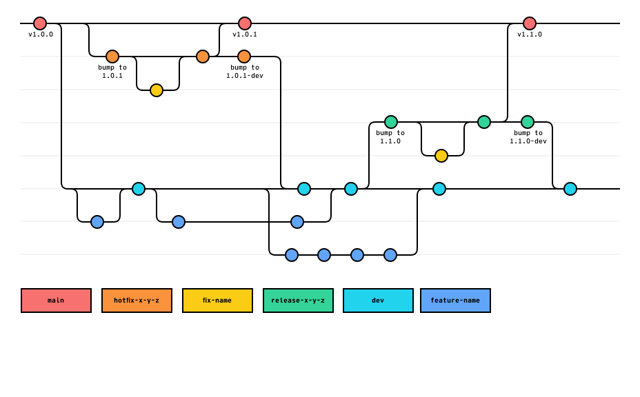

# Strategic Communications Developer Handbook

This document houses general rules of thumb and guidelines for workflows, versioning, naming conventions, repository setup, and other stuff related to organization and project management.

It is intended as supplementary material for the [university wide developer guidelines](https://web.ua.edu/developer/).

## Repository privacy & access

The default repository permission is set as "read", and elevated permissions must be given to each person on each repository they need elevated permissions on. Because of this, there are two groups within this organization. [Web team](https://github.com/orgs/UA-Stratcom/teams/web), which is comprised of all members of the Department of Web Communications, and the [Collaborators team](https://github.com/orgs/UA-Stratcom/teams/collaborators) for other developers on campus that want to contribute. Teams can be added to a repository with a team-wide permission level.

### Internal

All repositories marked as "Internal" may be seen any anyone within the UA Enterprise.

### Private

Repositories marked as "Private" are only visible to people who have specifically been invited to collaborate on that repository. **The Web group should be added to all repositories in the organization**, but the WDN group should only be added to those marked as "Internal" or "Public"

### Public

Public repositories are visible to everyone, even if they are not a part of the University and are generally considered "open source" projects. We do not currently have plans to make any of our projects open source, but may do so in the future.

## Repository setup

Consider using the [template repository](https://github.com/UA-Stratcom/template) when creating your new repo.

### Repository naming conventions

In general, all repository names should be in lower case and use hyphens `-` to separate words. The underscore `_` character is reserved for prefixes / subfixes. Repository names may not include any other special characters.

There are 4 types of repositories.

1. Static sites. These repositories contain code and data for a specific site, and should have the naming convention of `sitename_site`. Their privacy setting should be set to "private".
2. Theme & Child themes. These repositories contain modifications to a website but do not include any of the site's content. They should roughly follow the convention `sitename_theme`, have their privacy set to "private".
3. Plugins that achieve a single purpose but is not specific to any single site should follow the convention `feature_plugin`. The privacy of these repositories should default to "private" but may be made "internal" at leadership discretion.
4. High level projects do not have naming conventions outside the general rules above. Old major versions of high level projects may be named `project-name_v1` where "1" is the major version.

**Any repository that we no longer support should be marked as "archived".**

### Branches

Following the [GitFlow](https://www.atlassian.com/git/tutorials/comparing-workflows/gitflow-workflow) methodology, you should Always work with a minimum of 2 branches, a `dev` branch that can be changed and a `main` branch that serves as the most recent stable version.

### Rulesets

This section is under evaluation. It is advised to set up rulesets that prevent the main or dev branch from being deleted, version tags from being created by someone outside the web team, and require pull requests into the dev or main branches.

### Package.json guidelines

1. `private` should be set to `true` unless publishing the package publicly has been approved by leadership
2. `license` should be set to `none` unless a different license is approved by leadership and legal
3. The `author` field should always match:

```json
"author": {
  "name": "UA Division of Strategic Communications, Department of Web Strategy",
  "email": "web@ua.edu",
  "url": "https://stratcomm.ua.edu/web-strategy/"
},
```

### Build tools

`Make` should be used wherever possible over a different build tool. Make CLI is installed alongside git when using `xcode-select`

The following are considered reserved build keywords and should behave the same across every repository that uses them.

- `make`: Echos a list of available build scripts and what they do
- `make install`: Downloads and installs any project dependencies
- `make start`: Starts any background processes, docker containers, servers, etc.
- `make stop`: Stops any background processes, docker containers, servers, etc.
- `make dev`: Run the project in a local development environment
- `make build`: Build / compile any files that need to be created for the production version
- `make dist`: Build and package distributable files
- `make test`: Run all unit / integration tests
- `make lint`: Run all linting tests

## Reviewing a pull request

When reviewing a pull request, its important to consider code integrity, consistency with any established conventions, and testing. Here are some **example questions** you might ask yourself when reviewing code:

- Is the code unreasonably complicated or too abstracted?
- Is the code easy to read?
- Is the code well commented?
- Is the code maintainable?
- Can the code be extended, reused, or made to be more modular?
- Does the code follow formatting and style guides established for that language?
- Does the code duplicate any existing code, or override functionality declared elsewhere?
- Does the code pass all testing requirements?
- Does the code introduce any new problems or potential issues?
- Has the documentation been updated to reflect these changes, if applicable?
- Is that documentation well written easy to understand?

Its also a good idea to clone the repository and switch to the branch the PR is on and test any changes made yourself to make sure everything works as intended.

## Creating a release

A release should be made whenever the `main` branch is updated or based on a project by project roadmap / release schedule.

Refer to the [UA Developer Documentation](https://web.ua.edu/developer/version-control/) for versioning information.

## Git workflow

We use the GitFlow workflow for all major projects in this organization. Refer to the chart below for an overview of that workflow.



A few notes about our workflow:

- All git tags are located on main
- The dev branch is parallel to main
- Feature branches are created from dev
- When a feature is complete it is merged into dev
- When enough features and fixes are finished, a branch for a release is created from dev
- When the release is complete and the version number has been updated the release branch is merged into main
- After the release is merged into main, the version number is updated to include the -dev suffix and the release branch is merged back into dev
- If a critical issue in main is detected, a hotfix branch is created from main
- Once the hotfix is complete and the version number has been updated, it is merged into main
- After the hotfix is merged into main, the version number should be updated to include the -dev suffix and the hotfix branch is merged back into dev
- Feature branches should be kept up to date with dev to avoid future merge conflicts as a result of the branch growing stale
- Commits may be made directly on any branch EXCEPT dev and main, which require pull requests and code reviews
- Branches merging into dev require one code approval from a developer familiar with the codebase
- For major projects, branches merging into main require two code approvals, at least one of which must be from a non-developer

## Comments

You are 100% ENCOURAGED to comment. Code clarity is a higher priority than clever tricks or abstractions. If the code isn't completely clear, add a comment to help explain it.

If you use [Visual Studio Code](https://code.visualstudio.com/) (Recommended), please install the [Comment Anchors](https://marketplace.visualstudio.com/items?itemName=ExodiusStudios.comment-anchors) extension. This will give you handy navigational landmarks we use frequently in our projects.

Use large comments and the section keyword to divide code into sections. When using sections, no code should exist outside of a defined section.

```txt
/** =================================================================
  * SECTION Example
================================================================= **/

Put your code in here

/* !SECTION Example */
```
